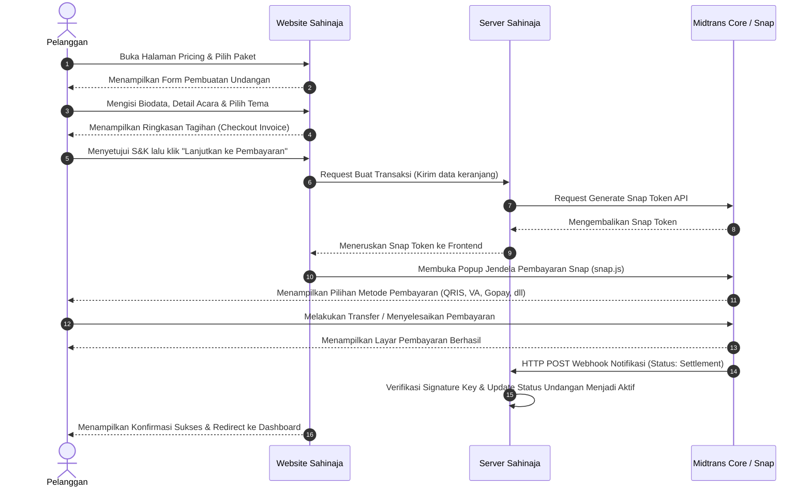

# Panduan Alur Transaksi Pembayaran Sahinaja

Dokumen ini menjelaskan alur transaksi (checkout flow) step-by-step dari pemilihan produk hingga penyelesaian pembayaran melalui Midtrans pada platform **Sahinaja**. Dokumentasi ini disusun sebagai bukti pemenuhan ketentuan operasional dan kepatuhan (compliance) Merchant Midtrans.

---

## Flowchart Diagram Transaksi

Berikut adalah bagan (flowchart) proses transaksi *end-to-end* yang berjalan secara aman di platform Sahinaja menggunakan integrasi Midtrans:

---

## Ringkasan Alur Transaksi

Secara garis besar, alur transaksi di Sahinaja terdiri dari 5 tahapan utama:
1. **Pemilihan Paket (Product Selection)**
2. **Pengisian Data Undangan (Invitation Wizard)**
3. **Halaman Ringkasan Tagihan & Checkout (Checkout Summary & T&C)**
4. **Jendela Pembayaran Midtrans Snap (Midtrans Snap Payment)**
5. **Konfirmasi Pembayaran Sukses (Payment Success)**

---

## Detail Langkah & Panduan Visual

### Langkah 1: Pemilihan Paket (Product Selection)
Pelanggan dapat memilih paket layanan undangan pernikahan digital yang sesuai dengan kebutuhan mereka melalui halaman pricing. Sahinaja menawarkan beberapa pilihan paket seperti:
- **Minimalist Plan** (Rp 75.000)
- **Premium Plan** (Rp 149.000)
- **Ultimate Plan** (Rp 185.000)

Setelah memilih paket, pelanggan menekan tombol **"Pilih Paket"** untuk mulai menyusun undangan mereka.

---

### Langkah 2: Pengisian Data Undangan (Invitation Wizard)
Pelanggan akan diarahkan ke halaman pembuatan draf undangan (*wizard form*). Pada tahap ini, pelanggan mengisi informasi penting pernikahan, meliputi:
- **Biodata Mempelai**: Nama lengkap mempelai pria & wanita, nama orang tua, dan media sosial.
- **Detail Acara**: Tanggal, waktu, dan lokasi akad serta resepsi (terintegrasi dengan peta).
- **Pilih Tema**: Menentukan visual tema desain undangan.

Setelah semua data terisi, pelanggan menekan tombol **"Lanjut ke Detail Acara"** atau **"Buat Undangan"**.

---

### Langkah 3: Halaman Ringkasan Tagihan & Checkout (Checkout Summary)
Pelanggan diarahkan ke halaman Checkout untuk meninjau rincian biaya sebelum melakukan pembayaran. Halaman ini memuat:
- **Detail Undangan**: Nama pasangan dan waktu acara.
- **Billing Invoice (Rincian Biaya)**:
  - Subtotal (sesuai paket pilihan)
  - PPN (Pajak Pertambahan Nilai) sebesar 11%
  - Biaya Layanan & Administrasi (Rp 2.500)
  - **Total Bayar**
- **Syarat & Ketentuan**: Kotak centang persetujuan Syarat & Ketentuan serta Kebijakan Privasi platform.

Pelanggan wajib mencentang persetujuan sebelum tombol **"Lanjutkan ke Pembayaran"** aktif.

---

### Langkah 4: Jendela Pembayaran Midtrans Snap (Midtrans Snap Payment)
Setelah mengonfirmasi checkout, sistem akan memanggil API Midtrans untuk membuat transaksi dan memunculkan jendela pembayaran **Midtrans Snap (Snap Popup)** secara langsung di dalam website Sahinaja.

Pelanggan dapat memilih metode pembayaran yang diinginkan:
1. **Gopay/QRIS**: Pembayaran instan dengan memindai kode QR.
2. **Virtual Account**: Bank transfer otomatis (BCA, Mandiri, BNI, dll.).
3. **Kartu Kredit/Debit**: Pembayaran online aman dengan kartu.

---

### Langkah 5: Konfirmasi Pembayaran Sukses (Payment Success)
Setelah pelanggan menyelesaikan pembayaran melalui metode pilihan mereka:
1. Midtrans mengirimkan notifikasi status pembayaran instan (settlement) melalui webhook ke server Sahinaja.
2. Sistem mendeteksi status sukses dan secara instan memperbarui status undangan menjadi aktif (Aktif/Premium).
3. Halaman checkout menampilkan dialog **"Pembayaran Berhasil!"** yang memuat:
   - Nomor Order / Order ID transaksi.
   - Nama paket yang aktif.
   - Metode pembayaran yang digunakan.
   - Total nominal bayar.
4. Pelanggan dapat menekan tombol **"Masuk ke Dashboard"** untuk langsung menyebarkan undangan pernikahan mereka.

---

## Hubungi Kami (Customer Service & Support)
Jika pelanggan atau pihak peninjau mengalami kendala saat memverifikasi alur transaksi, silakan hubungi tim dukungan kami melalui kontak resmi yang tercantum di bagian *footer* website utama.
